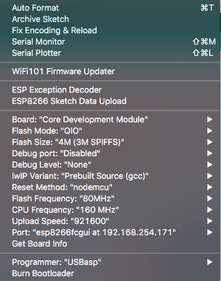
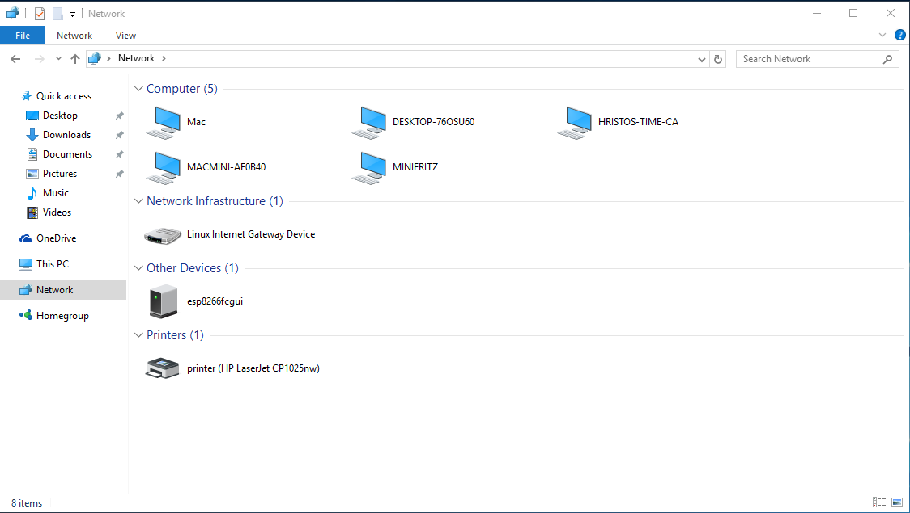
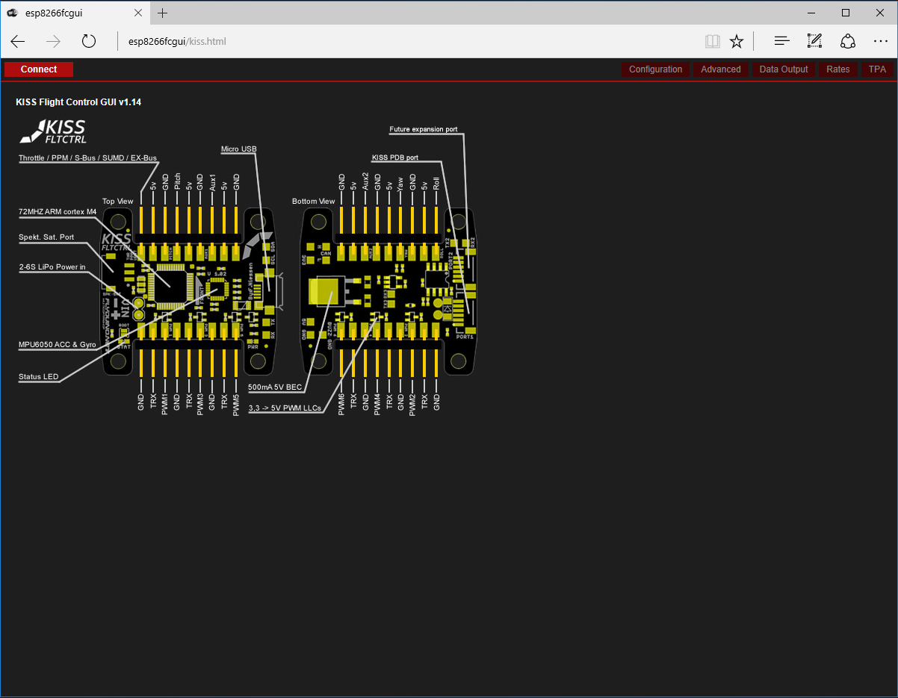
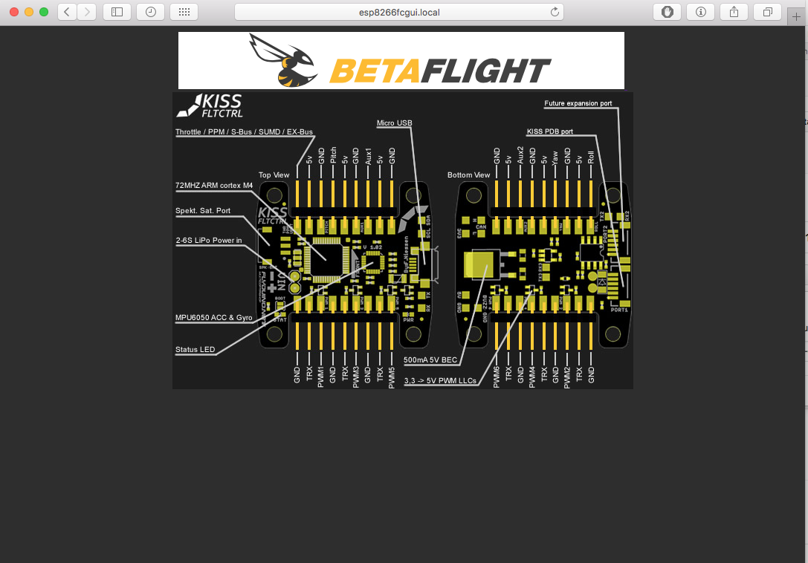
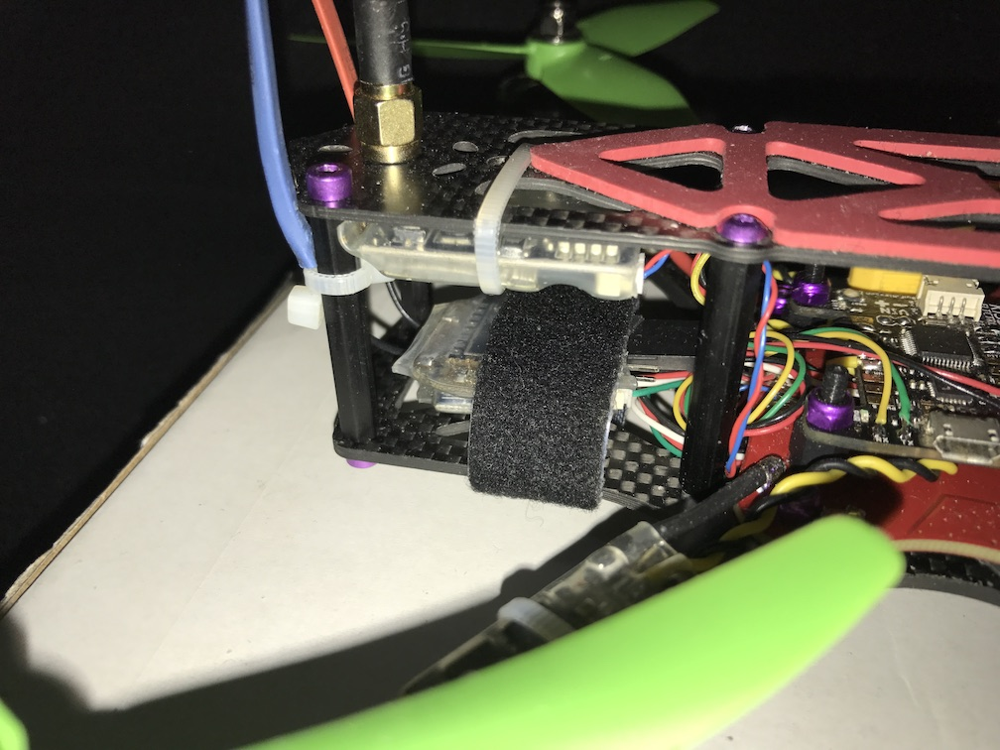

# ESP8266 FC GUI
KISS and BetaFlight GUI on ESP8266

## What is this?
- Simple sketch for ESP8266 Arduino that uses asyncronous networking to provide web and some other services
- Transparent WebSocket <=> UART
- inlined, optimized and gzipped version of [KISSFC_GUI_Dshot_T8](https://www.rcgroups.com/forums/showatt.php?attachmentid=9464379&d=1477306491)
- inlined, optimized and gzipped version of [Betaflight Configurator](https://github.com/betaflight/betaflight-configurator/tree/bcb361cac665b8ba9c4de2d93bdca2944e157dec)

## Why did you do this?
- Got really sick of having to carry a laptop to the field, just to change pid or recalibrate something
- ESP8266 has really evolved and is able to take on the load
- Various small ESP8266 based modules are available for close to nothing
- I carry a small computer in the form of smartphone everywhere
- Phone apps lack functionality and lag on implementation
- It's easy to do

## I want to try it!

### Requirements
- ESP8266 module with 4MB flash
- Recent version of [Arduino IDE](https://www.arduino.cc/en/Main/Software)
- Latest [Arduino ESP8266 filesystem uploader](https://github.com/esp8266/arduino-esp8266fs-plugin) plugin installed
- Git version of [ESP8266 Arduino](https://github.com/esp8266/Arduino#using-git-version)
- Git version of [ESPAsyncTCP](https://github.com/me-no-dev/ESPAsyncTCP)
- Git version of [ESPAsyncWebServer](https://github.com/me-no-dev/ESPAsyncWebServer)

### Compiling and upload
- Fullfill all requirements above
- Clone or download this repository to your computer
- Sketch ino and folder name MUST match
- Open the ino sketch with Arduino IDE
- Connect the ESP8266 module to your computer via USB
- Edit definitions in ```fc_config.h``` to your liking
- Select the following options for board in Arduino IDE
    - Board: Core Development Module
    - Flash Mode: QIO or DIO (depends on flash chip type)
    - Flash Size: 4M (3M SPIFFS)
    - Debug Port: Disabled
    - Debug Level: None
    - LwIP Variant: Prebuilt Source (gcc)
    - Reset Method: ck or nodemcu (depends on ESP module reset circuit)
    - Flash Frequency: 80MHz
    - CPU Frequency: 160 MHz
    - Upload Speed: 115200 (some can do 921600)
    - Port: Select the serial port of the ESP module
- Compile and upload the sketch
- From the "Tools" menu, select "ESP8266 Sketch Data Upload" to upload the web contents
- Restart the ESP to apply the new file system image

### Cool! Then what?

#### Connecting the module to your quad
- Select module that can accept 5 volts or get separate LDO to 3.3V for the ESP
- Connect
    1. ESP GND > FC GND
    2. ESP 5V > FC 5V (select pin that is also powered by the USB, if available)
    3. ESP TX > FC RX (UART port that you do not use and have configured for Telemetry/MSP)
    4. ESP RX > FC TX (Same port as above)

On my KISS quad, I also have OSD, so I use the GUI only when connected through USB to a power bank.

#### Using the AP defined in ```fc_config.h```
- Power the ESP module
- Connect to it's Access Point
- Try to open any website. It should forward you to the main page

#### Using your WiFi at home (```STA_SSID``` must be defined in ```fc_config.h```)
- Power the ESP module
- Windows
    - Check for the ESP in the Network Browser and doubliclick it
    - Or just open a browser to http://esp8266fcgui (the value of ```AP_SSID``` in ```fc_config.h```)
- Mac and Linux
    - Open a browser to http://esp8266fcgui.local (the value of ```AP_SSID``` in ```fc_config.h``` plus ".local")
- The sketch is [Arduino OTA](https://github.com/esp8266/Arduino/blob/master/doc/ota_updates/readme.md#arduino-ide) enabled, which means that when at home, you can update the firmware/file system over WiFi

## Credits
All web content is created by the KISS and BetaFlight teams. This a cut-down version of their work.

## Screen Shots

### Arduino IDE Settings


### Windows

#### Network Browser


#### Web Browser


### Mac and Linux

#### Web Browser


### Mobile


### Hardware


